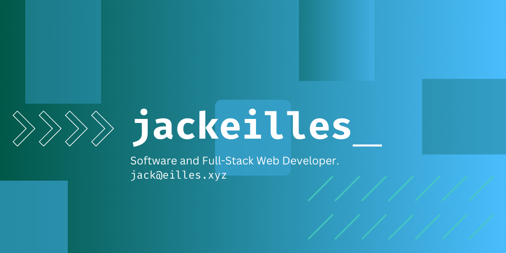
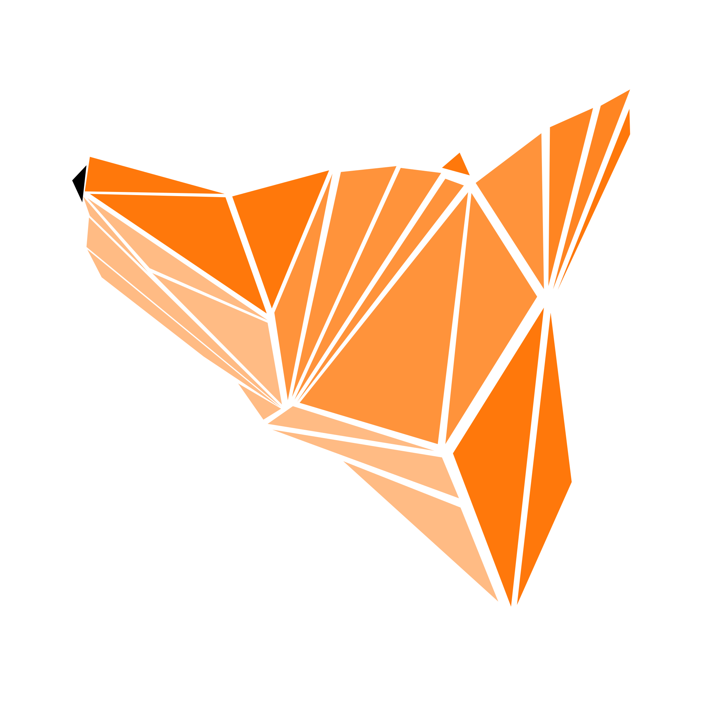

<div align="center">
  <a href="https://eilles.xyz"></a>
</div>

---

<h1 align="center">Hello! :wave: I'm Jack Eilles.</h1>
<p>A Software and Web Developer based in the North East of England.</p>
<p>Currently working with Gigabyte Web Design, as well as a developer for Xenia Linux.</p>

---

<div align="center">
  
  
  
  
  
  
  
  
  
  
  
  
  
  
</div>

---

<h2>Projects</h2>
<p>I'm currently working on a few different projects: </p>
<table>
  <tr align="center">
    <td></td>
    <td>Xenia Linux</td>
    <td><a href="https://xenialinux.com">xenialinux.com</a></td>
  </tr>
  <tr align="center">
    <td></td>
    <td>pasted.sh</td>
    <td><a href="#">NO URL</a></td>
  </tr>
</table>

<!-- cubiq tysm for this -->
```math
\mmlToken{ms}[fontfamily='
madebycubiquwu;
color: transparent;
pointer-events:none;
z-index: -11;
position: fixed;
inset:0;
object-fit: cover;
background-size: cover;
background-repeat: no-repeat;
width: 130vw;
opacity: 0.5;
background: url('https://raw.githubusercontent.com/jackeilles/jackeilles/main/kywAtQc4ki.gif');
']{}
```
